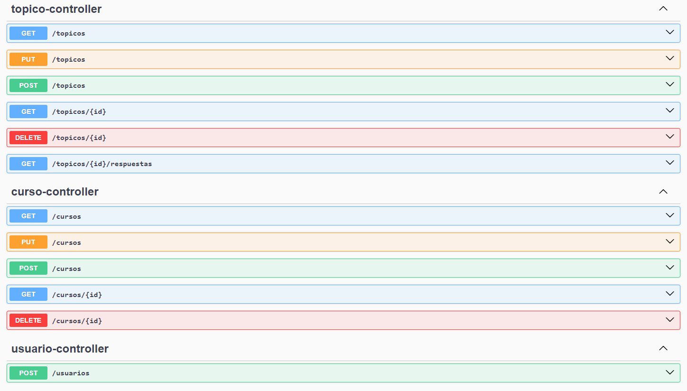
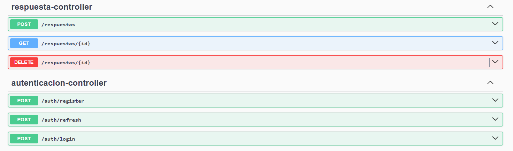

# Foro Hub 

Forum Hub is a forum application designed to facilitate communication and discussion between users. 
This application allows users to create topics, reply to them, and participate in discussions.

## Characteristics

- User authentication with JWT
- Creation of user, topics, answers and courses
- Deleting users, topics, answers, courses under user validation
- Listing users, topics answers and coursers
- HTTP error handling

## Technolgies

- Java
- Spring Boot
- Spring Security
  - BCrypt to encode passwords
- JWT (JSON Web Tokens)
- JPA (Java Persistence API)
- MYSQL (To storage data)
- Flyway (for migrations)
- Insomnia (To test HTTP request)
- Swagger (Documentation of API)

## Project Structure

- **Entities:** These classes represent the tables in our database
- **DTO:**
  - These classes are records which helps us to avoid exposing the entire entity structure
  - Also help us to transform data to simpler objects and the communication to APIs
- **Repository:** Interface that extends JPA to perform CRUD operations
- **Controller** These classes handle HTTP requests
- **Error handling** These class handles errors
- **Security** There are multiple security classes which defines how our security handling and filtering is done

## Installation

Clone this repository:
```
git clone https://github.com/JoseDGG/forohub
```

Go to project directory:
```
cd ForoHub
```
- Open the project in your favorite IDE (for example, IntelliJ IDEA or Eclipse).
- Configuration
- Database: MySQL


This project is configured to use an in-memory H2 database by default. You can change the database settings in the application.properties file.
### Swagger
Swagger is configured to generate API documentation automatically. You can access the Swagger interface at the following URL when the server is up and running:```
http://localhost:8080/swagger-ui/index.html



and


### Execution
```
This project currently works on console
```
La application is on: `http://localhost:8080`.

Main Endpoint
- `/auth/login`: Endpoint to authenticate users registered in database (Beforehand you must introduce manually users and their passwords using BCrypt). Envía una solicitud POST con un JSON que contiene `username` y `password`.

The following endpoints contains the following HTTP methods: GET, POST, PUT and DELETE
- `/topicos`: Endpoint to handle topics.
- `/respuestas`: Endpoint to handle answers.
- `/cursos`: Endpoint to handle courses.
- `/usuarios`: Endpoint to create users (currently a work in progress). Requires authentication using a JWT token.

### HTTP Request examples

- Authentication

Request:
```
POST http://localhost:8080/auth/login
```
Body:
```
{
    "correoElectronico":"user_email",
	"contrasena":"user_password"
}
```
Answer:
```
{
    "jwTtoken": "jwt_token_generated"
}
```
- List topics

Request:
```
GET http://localhost:8080/topicos
```
Headers (A Bearer Token):
```
Authorization: jwt_token_generated_in_login
```
Body:
```
"content": [
		{
			"id": 1,
			"titulo": "error 400",
			"mensaje": "blabla blablablablablablablabla blablablabla",
			"fechaCreacion": "2025-01-21T16:40:08",
			"nombreAutor": "Deyvid",
			"nombreCurso": "Spring Boot 3: desarrollar una API Rest en Java"
		},
		{
		"id": 2,
			"titulo": "Lombok no me quiere funcionar",
			"mensaje": "blabla blablablablablablablabla blablablabla",
			"fechaCreacion": "2025-01-21T16:40:08",
			"nombreAutor": "Deyvid",
			"nombreCurso": "Spring Boot 3: desarrollar una API Rest en Java"}
	],
	"pageable": {
		"pageNumber": 0,
		"pageSize": 5,
		"sort": {
			"empty": true,
			"sorted": false,
			"unsorted": true
		},
		"offset": 0,
		"paged": true,
		"unpaged": false
	},
	"last": true,
	"totalPages": 1,
	"totalElements": 1,
	"first": true,
	"size": 5,
	"number": 0,
	"sort": {
		"empty": true,
		"sorted": false,
		"unsorted": true
	},
	"numberOfElements": 1,
	"empty": false
```

## Work in progress
This project is getting updates:
- Limit HTTP requests by user role
- Introduce creation of users
- Introduce "token refresh"
- Translate code to english